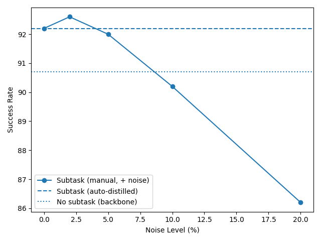

  
  
<b>Figure R1. Robustness to subtask annotation noise on LIBERO-Long.</b>
  Noise is injected by randomly replacing the subtask label and the object with probability (x%) (x ∈ {0, 2, 5, 10, 20}).

  
--- 

<b>Table R1. Success rate (%) across VIMA-Bench task levels (L1–L4)</b> 
Best results are <b>bold</b>, second-best are <i>italic</i>.

<table>
<tr>
<th align="left">Method</th>
<th align="center">Subprompt Supervision</th>
<th align="center">Subprompt Generation</th>
<th align="center">Concept Alignment</th>
<th align="center">Order Entropy</th>
<th align="center">L1</th>
<th align="center">L2</th>
<th align="center">L3</th>
<th align="center">L4</th>
</tr>

<tr>
<td align="left">VIMA (Small)</td>
<td align="center">None</td><td align="center">--</td><td align="center">--</td><td align="center">--</td>
<td align="center">72.4</td><td align="center">73.8</td><td align="center">71.1</td><td align="center">35.0</td>
</tr>

<tr>
<td align="left">VIMA (Large)</td>
<td align="center">None</td><td align="center">--</td><td align="center">--</td><td align="center">--</td>
<td align="center">73.9</td><td align="center">74.5</td><td align="center">72.0</td><td align="center"><i>59.0</i></td>
</tr>

<tr><td colspan="9" height="4"></td></tr>

<tr>
<td align="left">Stacked VIMA</td>
<td align="center">None</td><td align="center">×</td><td align="center">×</td><td align="center">×</td>
<td align="center">72.4</td><td align="center">73.6</td><td align="center">72.4</td><td align="center">34.0</td>
</tr>

<tr>
<td align="left">iSTAR (w/o Sup. & Align.)</td>
<td align="center">None</td><td align="center">×</td><td align="center">×</td><td align="center">✓</td>
<td align="center">74.1</td><td align="center">75.0</td><td align="center">73.6</td><td align="center">36.3</td>
</tr>

<tr>
<td align="left">iSTAR (w/o Align. & Order)</td>
<td align="center">Partial</td><td align="center">✓</td><td align="center">×</td><td align="center">×</td>
<td align="center">74.8</td><td align="center">76.0</td><td align="center">74.9</td><td align="center">37.7</td>
</tr>

<tr>
<td align="left">iSTAR (w/o Align.)</td>
<td align="center">Partial</td><td align="center">✓</td><td align="center">×</td><td align="center">✓</td>
<td align="center">77.8</td><td align="center">77.5</td><td align="center">77.0</td><td align="center">40.0</td>
</tr>

<tr>
<td align="left">iSTAR (w/o Sup.)</td>
<td align="center">Partial</td><td align="center">×</td><td align="center">✓</td><td align="center">✓</td>
<td align="center">76.7</td><td align="center">77.5</td><td align="center">76.4</td><td align="center">41.3</td>
</tr>

<tr>
<td align="left">iSTAR (w/o Order)</td>
<td align="center">Full</td><td align="center">✓</td><td align="center">✓</td><td align="center">×</td>
<td align="center">76.4</td><td align="center">77.6</td><td align="center">76.3</td><td align="center">42.7</td>
</tr>

<tr>
<td align="left">iSTAR (Ours)</td>
<td align="center">Full</td><td align="center">✓</td><td align="center">✓</td><td align="center">✓</td>
<td align="center"><i>78.6</i></td>
<td align="center"><i>79.2</i></td>
<td align="center"><i>78.3</i></td>
<td align="center">44.3</td>
</tr>

<tr><td colspan="9" height="6"></td></tr>

<tr>
<td align="left"><b>iSTAR (Large Reasoner, Ours)</b></td>
<td align="center">Full</td><td align="center">✓</td><td align="center">✓</td><td align="center">✓</td>
<td align="center"><b>78.8</b></td>
<td align="center"><b>80.0</b></td>
<td align="center"><b>81.1</b></td>
<td align="center"><b>67.7</b></td>
</tr>

</table>

--- 

<b>Table R2. Success rate (SR, %) on LIBERO and CALVIN.</b> 
Best results are <b>bold</b>, second-best are <i>italic</i>. 
<i>"w/o sup." denotes training without subtask-level supervision.</i>

<b>LIBERO</b>

<table>
<tr>
<th align="left">Method</th>
<th align="center">Params</th>
<th align="center">Spatial</th>
<th align="center">Object</th>
<th align="center">Goal</th>
<th align="center">Long</th>
<th align="center">Avg</th>
</tr>

<tr>
<td align="left">OpenVLA-OFT (RSS'25)</td>
<td align="center">7B</td>
<td align="center">96.2</td>
<td align="center"><i>98.3</i></td>
<td align="center"><b>96.2</b></td>
<td align="center">90.7</td>
<td align="center">95.3</td>
</tr>

<tr>
<td align="left">iSTAR (OFT, w/o sup.)</td>
<td align="center">8B</td>
<td align="center"><i>96.6</i></td>
<td align="center">98.2</td>
<td align="center"><b>96.2</b></td>
<td align="center"><i>91.8</i></td>
<td align="center"><i>95.7</i></td>
</tr>

<tr>
<td align="left">iSTAR (OFT, w/ sup.)</td>
<td align="center">8B</td>
<td align="center"><b>96.8</b></td>
<td align="center"><b>98.4</b></td>
<td align="center"><i>96.0</i></td>
<td align="center"><b>92.2</b></td>
<td align="center"><b>95.9</b></td>
</tr>

<tr><td colspan="7" height="1"></td></tr>

<tr>
<td align="left">X-VLA (ICLR'26)</td>
<td align="center">0.9B</td>
<td align="center">98.1</td>
<td align="center"><i>98.6</i></td>
<td align="center">97.8</td>
<td align="center">97.6</td>
<td align="center">98.1</td>
</tr>

<tr>
<td align="left">iSTAR (X-VLA, w/o sup.)</td>
<td align="center">1B</td>
<td align="center"><i>98.2</i></td>
<td align="center"><i>98.6</i></td>
<td align="center"><b>98.2</b></td>
<td align="center"><i>98.0</i></td>
<td align="center"><i>98.3</i></td>
</tr>

<tr>
<td align="left">iSTAR (X-VLA, w/ sup.)</td>
<td align="center">1B</td>
<td align="center"><b>98.4</b></td>
<td align="center"><b>99.0</b></td>
<td align="center"><i>98.0</i></td>
<td align="center"><b>98.6</b></td>
<td align="center"><b>98.5</b></td>
</tr>

</table>

 
<b>CALVIN (ABC→D)</b>

<table>
<tr>
<th align="left">Method</th>
<th align="center">Params</th>
<th align="center">1</th>
<th align="center">2</th>
<th align="center">3</th>
<th align="center">4</th>
<th align="center">5</th>
<th align="center">Avg</th>
</tr>

<tr>
<td align="left">X-VLA (ICLR'26)</td>
<td align="center">0.9B</td>
<td align="center">97.1</td>
<td align="center">92.6</td>
<td align="center">88.5</td>
<td align="center">84.4</td>
<td align="center">78.8</td>
<td align="center">4.43</td>
</tr>

<tr>
<td align="left">iSTAR (w/o sup.)</td>
<td align="center">1B</td>
<td align="center"><b>97.3</b></td>
<td align="center"><b>93.8</b></td>
<td align="center"><b>90.6</b></td>
<td align="center"><b>87.9</b></td>
<td align="center"><b>80.3</b></td>
<td align="center"><b>4.50</b></td>
</tr>

<tr>
<td align="left">iSTAR (w/ sup.)</td>
<td align="center">1B</td>
<td align="center"><b>92.4</b></td>
<td align="center"><b>95.3</b></td>
<td align="center"><b>93.6</b></td>
<td align="center"><b>89.6</b></td>
<td align="center"><b>85.1</b></td>
<td align="center"><b>4.56</b></td>
</tr>

</table>

---

<table>
  <caption><b>Table R3. Efficiency and Performance Comparison (Ours vs. OpenVLA-OFT).</b></caption>
  <thead>
    <tr>
      <th align="left">Item</th>
      <th align="center">OpenVLA-OFT</th>
      <th align="center">Ours (8B)</th>
    </tr>
  </thead>
  <tbody>
    <tr>
      <td><strong>Total params</strong></td>
      <td align="center">7B</td>
      <td align="center">8B</td>
    </tr>
    <tr>
      <td><strong>Trainable params</strong></td>
      <td align="center">279M</td>
      <td align="left">
        <strong>107M</strong> 
        <small>
          • Attribute gating: 17M 
          • Dynamic positional encoding: 17M 
          • Order gating & fusion: 17M 
          • Implicit relational reasoning + LoRA (r64): 22M 
          • Subtask Prompt Projector: 34M
        </small>
      </td>
    </tr>
    <tr>
      <td><strong>Training steps</strong></td>
      <td align="center">50K-150K</td>
      <td align="center">10K-20K</td>
    </tr>
    <tr>
      <td><strong>Per-step training time</strong></td>
      <td align="center">~3s</td>
      <td align="center">~4s</td>
    </tr>
    <tr>
      <td><strong>Inference latency</strong></td>
      <td align="center">0.0729s</td>
      <td align="center">0.1021s</td>
    </tr>
    <tr>
      <td><strong>Inference throughput</strong></td>
      <td align="center">109.7 Hz</td>
      <td align="center">68.6 Hz</td>
    </tr>
  </tbody>
</table>

<table>
  <caption><b>Table R4. Efficiency and Performance Comparison (Ours vs. X-VLA).</b></caption>
  <thead>
    <tr>
      <th align="left">Item</th>
      <th align="center">X-VLA</th>
      <th align="center">Ours (1B)</th>
    </tr>
  </thead>
  <tbody>
    <tr>
      <td><strong>Total params</strong></td>
      <td align="center">0.9B</td>
      <td align="center">1B</td>
    </tr>
    <tr>
      <td><strong>Trainable params</strong></td>
      <td align="center">0.9B (Full FT)</td>
      <td align="left">
        <strong>32M</strong> 
        <small>
          • Attribute gating: 1M 
          • Dynamic positional encoding: 1M 
          • Order gating & fusion: 1M 
          • Implicit relational reasoning + LoRA (r64): 4M 
          • Subtask Prompt Projector: 25M
        </small>
      </td>
    </tr>
    <tr>
      <td><strong>Training steps</strong></td>
      <td align="center">~100K–200K (full fine-tuning, following official setup)</td>
      <td align="center">15K</td>
    </tr>
    <tr>
      <td><strong>Per-step training time</strong></td>
      <td align="center">~1.5s</td>
      <td align="center">~1.7s</td>
    </tr>
    <tr>
      <td><strong>Inference latency</strong></td>
      <td align="center">0.0489s</td>
      <td align="center">0.0575s</td>
    </tr>
    <tr>
      <td><strong>Inference throughput</strong></td>
      <td align="center">167.2 Hz</td>
      <td align="center">134.5 Hz</td>
    </tr>
  </tbody>
</table>

